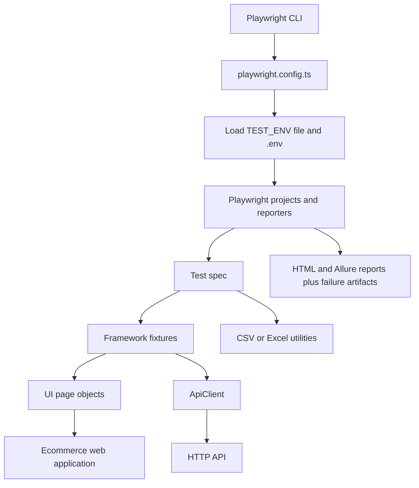

# Playwright ATF Framework Guide

This guide explains how the framework is assembled, how a test runs, where responsibilities belong, and how to add new test coverage. For first-time installation and environment setup, start with the [project README](../README.md).

## 1. What This Framework Provides

This repository is a TypeScript automation framework built on Playwright Test. It currently contains:

- Chromium browser tests for ecommerce UI flows.
- API request tests using Playwright's `APIRequestContext`.
- CSV and Excel data-reading utilities.
- Environment-based configuration for QA, STG, and Prod.
- Playwright HTML and Allure reporting, failure screenshots, video, and traces.

It is a small framework rather than a fully abstracted platform. Prefer its existing fixtures, page objects, and utilities when adding coverage; introduce new layers only when a real test need requires them.

## 2. Runtime Architecture



At configuration load time, `playwright.config.ts` validates `TEST_ENV`, loads the selected environment file when requested, then loads `.env` for values not already supplied. Playwright discovers specs under `tests/`, creates the configured browser project, and executes each test with its requested fixtures. Fixtures construct page objects around Playwright's `page` fixture or create and dispose an API request context. Assertions and artifacts are collected by Playwright and its configured reporters.

## 3. Repository Layout

| Location | Responsibility |
| --- | --- |
| `playwright.config.ts` | Playwright test discovery, environment loading, browser project, timeouts, retries, and reporters |
| `src/core/config.ts` | Reads application URLs and test-account credentials from `process.env` |
| `src/core/api-client.ts` | Shared typed GET, POST, and text request helpers |
| `src/fixtures/test.fixture.ts` | Composes and exposes page-object and API-client fixtures |
| `src/pages/` | UI selectors and user actions grouped by application page |
| `src/api/` | Domain API services such as `CatalogApi` |
| `src/utils/csv.ts` | CSV parsing and header validation |
| `src/utils/excel.ts` | Excel sheet reading, file checks, shared `DataRow` type, and column validation |
| `tests/ui/` | Browser-based user scenarios |
| `tests/api/` | API and test-data validation specs |
| `test-data/` | Non-secret input data such as `products.csv` |
| `playwright-report/` | Generated Playwright HTML report; ignored by Git |
| `allure-results/`, `allure-report/` | Generated Allure results and report; ignored by Git |
| `test-results/` | Generated test artifacts; ignored by Git |

## 4. Configuration and Environments

`playwright.config.ts` recognizes `qa`, `stg`, and `prod` as `TEST_ENV` values. If `TEST_ENV` is unset, it loads `.env`. If it is set, the matching `.env.<environment>` file is required and loaded before `.env`. Dotenv does not overwrite values already present in the process environment, so CI-provided variables can take precedence over file values.

The runtime settings are defined in `src/core/config.ts`:

| Variable | Purpose |
| --- | --- |
| `BASE_URL` | Web application URL used by `LoginPage` |
| `API_BASE_URL` | Base URL for the shared API request context |
| `TEST_USER_EMAIL` | Dedicated test-account email |
| `TEST_USER_PASSWORD` | Dedicated test-account password |
| `HEADLESS` | Set to the exact string `false` to show the browser; otherwise tests run headless |

The example environment files are safe templates. Local `.env` and `.env.<environment>` files are ignored by Git. Set real credentials only in local ignored files or the CI platform's secret store. Do not put credentials in tests, CSV files, reports, documentation, or commits.

The current Playwright configuration uses Chromium. It runs tests fully parallel by default, retries twice and uses one worker when `CI` is set, and has 15-second action and 30-second navigation timeouts. The existing `shopping.spec.ts` requests serial execution for tests in that file. Both Playwright HTML and Allure reporters are enabled; screenshots, video, and traces are retained on failure. Playwright test runs write Allure raw data to `allure-results/`.

## 5. Fixtures and Test Composition

`src/fixtures/test.fixture.ts` extends Playwright's base `test` with these framework fixtures:

- `loginPage`: a `LoginPage` bound to the current test's browser page.
- `dashboardPage`: a `DashboardPage` bound to the same page.
- `cartPage`: a `CartPage` bound to the same page.
- `paymentPage`: a `PaymentPage` bound to the same page.
- `apiClient`: an `ApiClient` over a newly created request context using `API_BASE_URL`; the context is disposed after the test.

UI specs import `test` from the framework fixture module and receive only the fixtures they declare:

```ts
import { test } from '../../src/fixtures/test.fixture';

test('customer can remove a product from the cart', async ({ loginPage, dashboardPage, cartPage }) => {
  await loginPage.open();
  await loginPage.login();
  await dashboardPage.addProductToCart('ZARA COAT 3');
  await dashboardPage.openCart();
  await cartPage.removeProduct('ZARA COAT 3');
});
```

For assertions in UI specs, import `expect` from the same fixture module. API specs that do not need framework fixtures can import `test` and `expect` directly from `@playwright/test`.

## 6. Page Objects

Page objects in `src/pages/` keep locators and user actions out of test scenarios:

- `LoginPage` opens the configured URL, enters the configured account credentials, and checks that login reaches the client application.
- `DashboardPage` locates a product card, checks that the product is available, adds it to the cart, and opens the cart.
- `CartPage` checks for a product, removes it, and proceeds to checkout.
- `PaymentPage` selects a country from the checkout autocomplete and places the order; it verifies the order-success route and confirmation heading.

Use Playwright locator APIs and web-first assertions inside page objects. Add a method when it represents a meaningful page action or assertion used by tests. Keep scenario sequencing and test-specific data choices in the spec.

## 7. API Layer

`ApiClient` wraps Playwright requests:

- `get<T>(path, params?)` sends a GET, verifies an OK response, and parses JSON as `T`.
- `post<T>(path, data)` sends a POST, verifies an OK response, and parses JSON as `T`.
- `getText(path)` sends a GET, verifies an OK response, and returns response text.

`CatalogApi` demonstrates a domain-specific service composed from `ApiClient`. It currently exposes `getAll<T>()` for the product catalog endpoint. It is implemented but is not yet registered as a fixture or used by a spec. To inject a new API service, construct it in `test.fixture.ts`, add its type to `FrameworkFixtures`, and expose it through `base.extend`.

## 8. Test Data Utilities

`readCsv(filePath)` reads UTF-8 CSV using `csv-parse/sync`, treats the first row as object keys, skips empty lines, and enables parser casting. It returns `DataRow[]`, where each row maps column names to scalar values. `validateHeaders(rows, expected)` compares the first row's column names and order with the expected list.

`readExcelSheet(filePath, sheetName?)` reads the named worksheet or the first worksheet and returns rows with missing cells represented as `null`. `assertExcelExists` checks for a file, while `validateColumns` checks the first row's keys. These Excel helpers are available for future specs; the current test suite exercises the CSV path.

`tests/api/data-validation.spec.ts` verifies that `products.csv` has `name` and `category` columns and contains the expected product row. `tests/ui/ShoppingFromCSV.spec.ts` reads the first product name from that file and uses it in a complete UI order flow. The other shopping spec currently uses a fixed product name.

When adding CSV-driven flows, resolve data paths from `process.cwd()` so they are stable when Playwright is launched from the project root. Validate that required rows and values exist before using them in UI actions.

## 9. Current Test Scenarios

| Spec | Scenario |
| --- | --- |
| `tests/api/health.spec.ts` | Requests `/` through `apiClient` and checks for the HTML doctype. |
| `tests/api/data-validation.spec.ts` | Reads the product CSV, validates headers, and checks the sample product. |
| `tests/ui/shopping.spec.ts` | Logs in, adds a fixed product, removes it from the cart; a second scenario adds the product and enters checkout country. |
| `tests/ui/ShoppingFromCSV.spec.ts` | Reads the first CSV product, logs in, adds it, checks the cart, enters shipping country, places the order, and attaches a full-page confirmation screenshot. |

## 10. Run Tests and Review Results

```powershell
npm test
npm run test:allure
npm run test:ui
npm run test:api
npm run typecheck
npm run report
npm run allure:generate
npm run allure:open
```

Run `npm run test:allure` to execute the full suite sequentially and create a fresh Allure report in one command. Then run `npm run allure:open` to view it. Do not open `allure-report/index.html` directly from disk; the report's assets must be served by the Allure CLI. This command is sequential because the sample UI scenarios share a test account and can interfere when run concurrently. The Playwright HTML report is also generated under `playwright-report/`. For manual report generation, `npm run allure:generate` processes the files currently in `allure-results/`; normal Playwright runs can leave results from prior runs in that directory. Allure 3 is installed as a project dependency, so report generation does not require Java or a global CLI install. Failure screenshots, video, and traces are saved under `test-results/`; tests can also attach named artifacts, such as the successful order-confirmation screenshot, which Allure includes in its report.

## 11. Adding Coverage

1. Add a spec under `tests/ui/` or `tests/api/` and use a descriptive behavior-oriented test name.
2. For browser interactions, use the shared fixtures and put reusable page interactions in the matching page object.
3. For API behavior, compose a domain service from `ApiClient`; register it as a fixture only when specs need injection.
4. Put non-secret reusable input data under `test-data/`; read it through the existing utilities where applicable.
5. Keep environment-specific URLs and credentials in ignored local environment files or CI secrets.
6. Run the focused spec, then `npm run typecheck`. Run the wider suite when shared fixtures, page objects, or core utilities change.